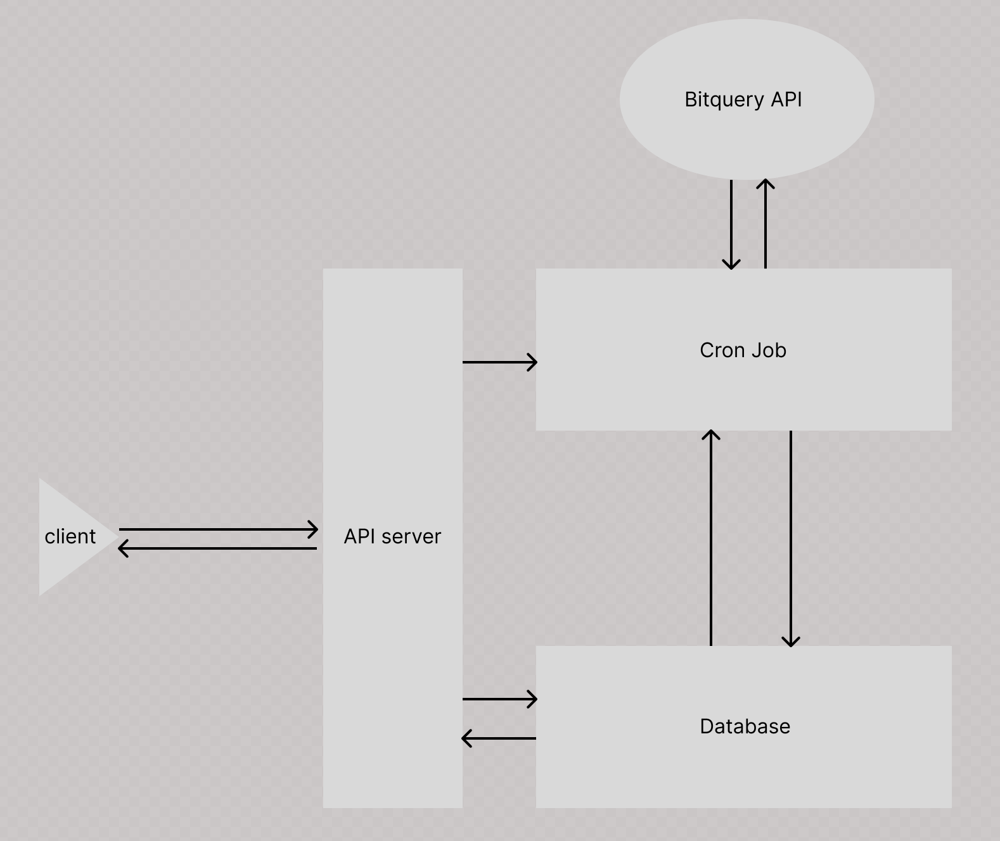

# cron-bitquery

- Implements a Bitquery API integration to track the largest whale accounts and on the Binance network.
- Ensures the backend supports real-time monitoring of accounts and transaction, updating the data at regular intervals using a cron job.

## Develop

### Configure environment variables in .env file

- MONGODB_URI: MongoDB connection URL
- APP_PORT: Should match docker exposed ports
- INITIAL_INTERVAL: Initial cron job interval
- TOKEN_ADDRESS: Updatable token address to monitor whales
- BIT_QUERY_TOKEN: Bitquery API V2 token.

### Set up

- Install dependencies

```bash
yarn
```

### Run locally

```bash 
yarn dev
```

### Run in docker

```bash
docker build -t cron-bitquery .  && docker run cron-bitquery
```

### Run with docker compose

```bash
docker-compose up --scale app=1
```

### Test APIs on local server

- Health check

```bash
curl --location 'http://localhost:8080'
```

- Set interval

```bash
curl --location 'http://localhost:8080/api/v1/cron-bitquery/intervals/set' \
--header 'Content-Type: application/json' \
--data '{
    "interval": 10,
    "frame": "minutes"
}'
```

- Set Token Address

```bash
curl --location 'http://localhost:8080/api/v1/cron-bitquery/address/set' \
--header 'Content-Type: application/json' \
--data '{
    "tokenAddress": "0x55d398326f99059ff775485246999027b3197955"
}'
```

- Get top 10 whales

```bash
curl --location 'http://localhost:8080/api/v1/cron-bitquery/whales/get'
```

- Get top 10 whales transactions

```bash
curl --location 'http://localhost:8080/api/v1/cron-bitquery/transactions/get'
```

## Design


